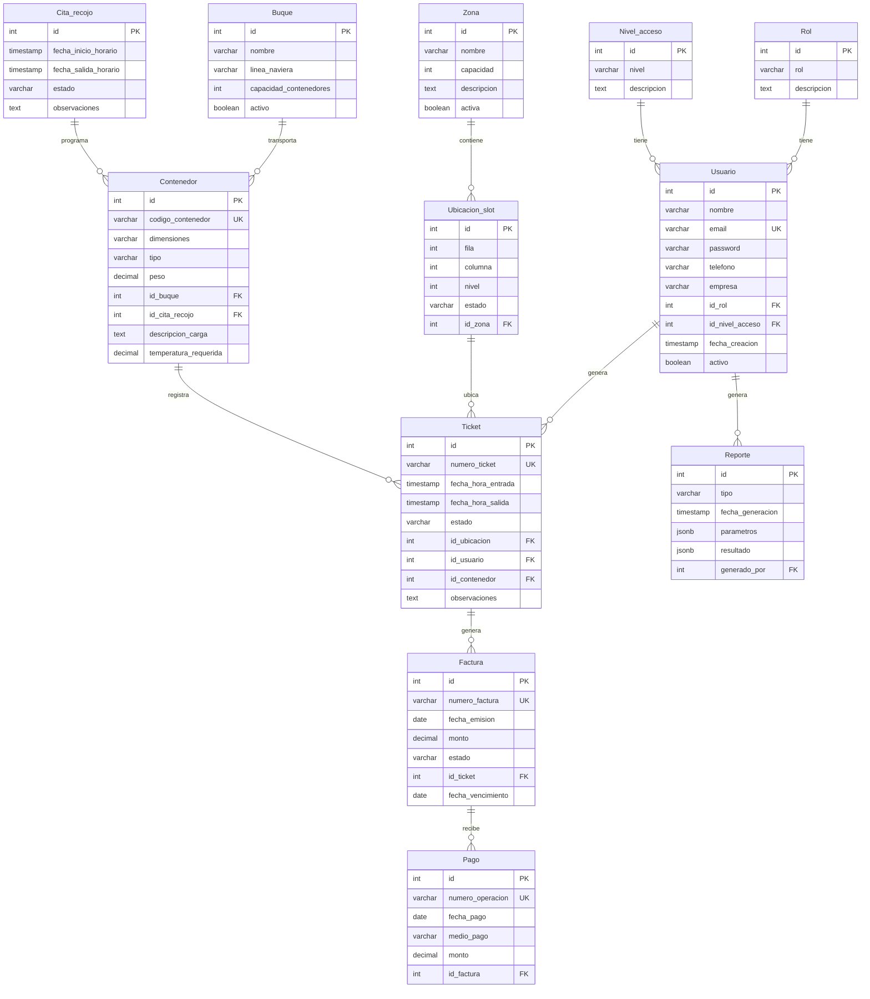

# 📘 Guía de Migración a Supabase - Sistema ENAPU

## 🎯 Resumen

Este documento te guiará paso a paso para migrar tu base de datos PostgreSQL local del sistema ENAPU a Supabase (PostgreSQL en la nube).

---

## 📋 Tabla de Contenidos

1. [Entidades y Relaciones del Sistema](#entidades-y-relaciones)
2. [Prerequisitos](#prerequisitos)
3. [Paso 1: Crear Proyecto en Supabase](#paso-1-crear-proyecto-en-supabase)
4. [Paso 2: Ejecutar el Script de Migración](#paso-2-ejecutar-el-script)
5. [Paso 3: Verificar la Migración](#paso-3-verificar)
6. [Paso 4: Conectar tu Aplicación](#paso-4-conectar-aplicacion)
7. [Características Implementadas](#caracteristicas)
8. [Seguridad y RLS](#seguridad)
9. [Próximos Pasos](#proximos-pasos)

---

## 🗂️ Entidades y Relaciones del Sistema {#entidades-y-relaciones}

### Tablas de Catálogo

- **Rol**: Define los roles de usuario (Administrador, Operario, Cliente)
- **Nivel_acceso**: Define los niveles de acceso (Administración, Operación, Consulta)

### Tablas de Usuarios

- **Usuario**: Información de usuarios con autenticación
  - Campos: id, nombre, email, password, teléfono, empresa, rol, nivel_acceso, activo, fechas

### Tablas de Ubicación

- **Zona**: Zonas del puerto (Estandar Seco, Reefer, Inspección)
  - Campos: id, nombre, capacidad, descripción, activa
- **Ubicacion_slot**: Slots individuales de almacenamiento
  - Campos: id, fila, columna, nivel, estado, id_zona
  - Estados: Vacio, Ocupado, Reservado, Mantenimiento

### Tablas de Operaciones Marítimas

- **Buque**: Información de los buques
  - Campos: id, nombre, línea_naviera, capacidad_contenedores, activo
- **Cita_recojo**: Citas programadas para recoger contenedores
  - Campos: id, fecha_inicio, fecha_salida, estado, observaciones
  - Estados: Programada, Completada, Vencida, Cancelada
- **Contenedor**: Contenedores almacenados
  - Campos: id, código, dimensiones, tipo, peso, id_buque, id_cita_recojo
  - Tipos: Seco, Refrigerado, Open Top, Flat Rack, Tanque

### Tablas de Gestión Operativa

- **Ticket**: Tickets de operación de contenedores
  - Campos: id, número_ticket, fecha_entrada, fecha_salida, estado, id_ubicacion, id_usuario, id_contenedor
  - Estados: Activo, Finalizado, Cancelado
- **Factura**: Facturas generadas
  - Campos: id, número_factura, fecha_emision, monto, estado, id_ticket
  - Estados: Pendiente, Pagada, Vencida, Anulada
- **Pago**: Pagos realizados
  - Campos: id, número_operacion, fecha_pago, medio_pago, monto, id_factura
  - Medios: Efectivo, Transferencia, Tarjeta, Cheque, Depósito

### Tabla de Reportes

- **Reporte**: Registro de reportes generados
  - Campos: id, tipo, fecha_generación, parámetros (JSONB), resultado (JSONB), generado_por

### Diagrama de Relaciones



---

## ✅ Prerequisitos {#prerequisitos}

Antes de comenzar, asegúrate de tener:

- [ ] Una cuenta en [Supabase](https://supabase.com) (es gratis)
- [ ] Acceso al archivo `supabase_migration_complete.sql` (ya generado)
- [ ] Navegador web moderno (Chrome, Firefox, Edge, Safari)

---

## 🚀 Paso 1: Crear Proyecto en Supabase {#paso-1-crear-proyecto-en-supabase}

### 1.1. Registrarse en Supabase

1. Ve a [https://supabase.com](https://supabase.com)
2. Haz clic en **"Start your project"**
3. Regístrate con GitHub, Google o email
4. Confirma tu email si es necesario

### 1.2. Crear un Nuevo Proyecto

1. Una vez dentro, haz clic en **"New Project"**
2. Selecciona tu organización (o crea una nueva)
3. Completa los datos del proyecto:
   - **Name**: `ENAPU-Sistema` (o el nombre que prefieras)
   - **Database Password**: Crea una contraseña segura y **GUÁRDALA** (la necesitarás después)
   - **Region**: Selecciona la más cercana a tus usuarios (ejemplo: `South America (São Paulo)`)
   - **Pricing Plan**: Free (suficiente para desarrollo)
4. Haz clic en **"Create new project"**
5. Espera 2-3 minutos mientras Supabase configura tu base de datos

### 1.3. Acceder al SQL Editor

1. En el panel izquierdo de Supabase, haz clic en el ícono **"SQL Editor"**
   (icono con símbolo `</>` o `SQL`)
2. Verás un editor de SQL en blanco

---

## 📝 Paso 2: Ejecutar el Script de Migración {#paso-2-ejecutar-el-script}

### 2.1. Abrir el Script

1. Abre el archivo `supabase_migration_complete.sql` con un editor de texto (VS Code, Notepad++, etc.)
2. Selecciona **TODO** el contenido del archivo (Ctrl+A)
3. Copia el contenido (Ctrl+C)

### 2.2. Ejecutar el Script en Supabase

1. Regresa al **SQL Editor** de Supabase
2. Pega todo el script SQL en el editor (Ctrl+V)
3. ⚠️ **IMPORTANTE**: Lee las notas en el script:
   - Si quieres **empezar desde cero** (recomendado para primera vez): deja el script como está
   - Si ya tienes datos y NO quieres borrarlos: comenta las líneas de `DROP TABLE` (líneas 20-32)
4. Haz clic en el botón **"Run"** (▶️) en la esquina inferior derecha
5. Espera a que se complete la ejecución (puede tomar 30-60 segundos)

### 2.3. Verificar que no hay Errores

- Si todo salió bien, verás mensajes de éxito en verde
- Al final deberías ver:
  - Una tabla con "Tablas creadas", "Funciones creadas", "Triggers creados"
  - Un resumen de registros insertados en cada tabla

⚠️ **Si hay errores**: Lee el mensaje de error, es probable que:

- Ya existan algunas tablas (entonces comenta las líneas DROP TABLE)
- Haya un problema de sintaxis (verifica que copiaste todo el script completo)

---

## ✔️ Paso 3: Verificar la Migración {#paso-3-verificar}

### 3.1. Verificar las Tablas

1. En el panel izquierdo de Supabase, haz clic en **"Table Editor"**
2. Deberías ver todas estas tablas:
   - ✅ Rol
   - ✅ Nivel_acceso
   - ✅ Usuario
   - ✅ Zona
   - ✅ Ubicacion_slot
   - ✅ Buque
   - ✅ Cita_recojo
   - ✅ Contenedor
   - ✅ Ticket
   - ✅ Factura
   - ✅ Pago
   - ✅ Reporte

### 3.2. Verificar los Datos

1. Haz clic en cada tabla para ver los datos
2. Ejemplos de verificación:
   - **Rol**: Debe tener 3 registros (Administrador, Operario, Cliente)
   - **Usuario**: Debe tener 10+ usuarios
   - **Zona**: Debe tener 3 zonas
   - **Ubicacion_slot**: Debe tener 25 slots
   - **Buque**: Debe tener 10 buques
   - **Ticket**: Debe tener 8 tickets

### 3.3. Probar una Consulta

1. Ve al **SQL Editor**
2. Crea una nueva consulta y ejecuta:

```sql
-- Ver todos los tickets activos con información completa
SELECT
    t.id,
    t.numero_ticket,
    t.estado,
    u.nombre as usuario,
    c.codigo_contenedor,
    c.tipo as tipo_contenedor,
    z.nombre as zona,
    us.fila, us.columna, us.nivel
FROM Ticket t
JOIN Usuario u ON t.id_usuario = u.id
JOIN Contenedor c ON t.id_contenedor = c.id
JOIN Ubicacion_slot us ON t.id_ubicacion = us.id
JOIN Zona z ON us.id_zona = z.id
WHERE t.estado = 'Activo';
```

3. Deberías ver los tickets activos con toda la información relacionada

---

## 🔌 Paso 4: Conectar tu Aplicación {#paso-4-conectar-aplicacion}

### 4.1. Obtener las Credenciales de Conexión

1. En Supabase, ve a **"Settings"** (⚙️) → **"API"**
2. Encontrarás 3 datos importantes:
   - **Project URL**: `https://xxx.supabase.co`
   - **anon public key**: Una clave larga que empieza con `eyJ...`
   - **service_role key**: Otra clave (solo para backend, NO la expongas en frontend)

### 4.2. Configurar tu Archivo `.env`

Crea o actualiza tu archivo `.env` en tu proyecto:

```env
# Supabase
VITE_SUPABASE_URL=https://xxx.supabase.co
VITE_SUPABASE_ANON_KEY=eyJhbGc...tu_clave_aqui
```

**Importante**:

- Reemplaza `xxx.supabase.co` con tu URL real
- Reemplaza `eyJhbGc...` con tu `anon public` key
- Si usas React con Vite, usa el prefijo `VITE_`
- Si usas Next.js, usa el prefijo `NEXT_PUBLIC_`

### 4.3. Instalar el Cliente de Supabase

En tu proyecto frontend, instala el cliente de Supabase:

```bash
npm install @supabase/supabase-js
```

### 4.4. Crear el Cliente de Supabase

Crea un archivo `src/supabase/client.js` (o `.ts`):

```javascript
import { createClient } from "@supabase/supabase-js";

const supabaseUrl = import.meta.env.VITE_SUPABASE_URL;
const supabaseAnonKey = import.meta.env.VITE_SUPABASE_ANON_KEY;

export const supabase = createClient(supabaseUrl, supabaseAnonKey);
```

### 4.5. Ejemplo de Uso en tu Aplicación

```javascript
import { supabase } from "./supabase/client";

// Obtener todos los tickets activos
async function getTicketsActivos() {
  const { data, error } = await supabase
    .from("Ticket")
    .select(
      `
      *,
      Usuario (*),
      Contenedor (*),
      Ubicacion_slot (*, Zona (*))
    `
    )
    .eq("estado", "Activo");

  if (error) {
    console.error("Error:", error);
    return null;
  }

  return data;
}

// Crear un nuevo ticket
async function crearTicket(ticketData) {
  const { data, error } = await supabase
    .from("Ticket")
    .insert([ticketData])
    .select();

  if (error) {
    console.error("Error:", error);
    return null;
  }

  return data[0];
}

// Actualizar un ticket
async function finalizarTicket(ticketId) {
  const { data, error } = await supabase
    .from("Ticket")
    .update({
      estado: "Finalizado",
      fecha_hora_salida: new Date().toISOString(),
    })
    .eq("id", ticketId)
    .select();

  if (error) {
    console.error("Error:", error);
    return null;
  }

  return data[0];
}
```

---

## ⭐ Características Implementadas {#caracteristicas}

### ✅ Auto-Incremento con SERIAL

Todas las tablas usan `SERIAL` para los IDs, por lo que se generan automáticamente.

### ✅ Generación Automática de Números

- **Tickets**: Se genera automáticamente `numero_ticket` con formato `TKT-YYYYMMDD-000001`
- **Facturas**: Se genera automáticamente `numero_factura` con formato `FAC-YYYYMMDD-000001`

### ✅ Actualización Automática de Timestamps

- Las tablas `Usuario`, `Ticket` y `Ubicacion_slot` tienen `fecha_modificacion` que se actualiza automáticamente con triggers

### ✅ Actualización Automática de Estados de Ubicación

- Cuando creas un Ticket con estado "Activo", la `Ubicacion_slot` se marca automáticamente como "Ocupado"
- Cuando finalizas un Ticket, la ubicación se marca como "Vacio"

### ✅ Validaciones con CHECK Constraints

- Estados de tickets validados
- Estados de citas validadas
- Tipos de contenedores validados
- Medios de pago validados
- Capacidades > 0
- Fechas lógicas (salida >= entrada)

### ✅ Índices para Rendimiento

Se crearon 18 índices para optimizar las consultas más comunes:

- Búsqueda de usuarios por rol, email
- Búsqueda de tickets por estado, usuario, fecha
- Búsqueda de contenedores por buque, tipo
- Búsqueda de facturas por estado, fecha
- etc.

### ✅ Campos JSONB para Flexibilidad

La tabla `Reporte` usa campos JSONB para `parametros` y `resultado`, permitiendo almacenar datos flexibles.

---

## 🔒 Seguridad y RLS (Row Level Security) {#seguridad}

### ¿Qué es RLS?

Row Level Security (RLS) es una característica de PostgreSQL que permite controlar qué filas puede ver/modificar cada usuario.

### Políticas Implementadas

El script incluye políticas básicas de RLS:

#### Para la tabla `Usuario`:

- ✅ **Administradores** pueden ver/editar todos los usuarios
- ✅ **Usuarios normales** solo pueden ver su propia información

#### Para la tabla `Ticket`:

- ✅ **Administradores y Operarios** pueden ver todos los tickets
- ✅ **Clientes** solo pueden ver sus propios tickets

### 🚨 Importante sobre RLS

**Las políticas RLS actuales están comentadas porque usan `auth.uid()`**, que es la función de autenticación de Supabase Auth.

Para usar RLS, necesitas:

1. **Configurar Supabase Auth** (autenticación de usuarios)
2. **Descomentar las secciones de RLS** en el script (PASO 11)
3. **Ajustar las políticas** según tus necesidades

**Por ahora**, puedes:

- Dejar RLS deshabilitado para desarrollo
- Implementar seguridad en tu backend/API
- Activar RLS cuando configures Supabase Auth

### Cómo Configurar Supabase Auth (Opcional)

Esta es una guía rápida, pero deberás investigar más según tus necesidades:

1. En Supabase, ve a **"Authentication"** → **"Settings"**
2. Configura los proveedores de autenticación (Email, Google, GitHub, etc.)
3. En tu frontend, usa el cliente de Supabase para autenticar:

```javascript
// Registro
const { data, error } = await supabase.auth.signUp({
  email: "usuario@ejemplo.com",
  password: "contraseña123",
});

// Login
const { data, error } = await supabase.auth.signInWithPassword({
  email: "usuario@ejemplo.com",
  password: "contraseña123",
});

// Logout
await supabase.auth.signOut();

// Obtener usuario actual
const {
  data: { user },
} = await supabase.auth.getUser();
```

4. Una vez configurado, descomenta y ajusta las políticas RLS

---

## 🎯 Próximos Pasos {#proximos-pasos}

### 1. ⚠️ Seguridad de Contraseñas

**IMPORTANTE**: El script usa contraseñas en texto plano solo para demostración.

**Debes implementar hash de contraseñas**:

```javascript
// En tu backend (Node.js ejemplo)
import bcrypt from "bcrypt";

// Al registrar un usuario
const hashedPassword = await bcrypt.hash(password, 10);

// Al verificar login
const isValid = await bcrypt.compare(password, hashedPassword);
```

O mejor aún, **usa Supabase Auth** que maneja todo esto automáticamente.

### 2. 🔐 Configurar Autenticación

Opciones:

- **Opción A**: Usar Supabase Auth (recomendado, más fácil)
- **Opción B**: Implementar tu propio sistema de autenticación con JWT

### 3. 📊 Migrar Datos Existentes

Si tienes datos en tu PostgreSQL local que quieres migrar:

1. Exporta los datos de tu base local:

```bash
pg_dump -U postgres -d enapu --data-only --inserts > datos_existentes.sql
```

2. Ajusta el SQL generado para que coincida con los IDs en Supabase
3. Ejecuta el SQL en el SQL Editor de Supabase

### 4. 🧪 Probar Todas las Funcionalidades

Prueba en el SQL Editor:

```sql
-- Crear un nuevo ticket (el número se genera automático)
INSERT INTO Ticket (fecha_hora_entrada, estado, id_ubicacion, id_usuario, id_contenedor)
VALUES (NOW(), 'Activo', 5, 3, 1);

-- Ver el ticket creado con su número generado
SELECT * FROM Ticket ORDER BY id DESC LIMIT 1;

-- Ver que la ubicación se marcó como 'Ocupado'
SELECT * FROM Ubicacion_slot WHERE id = 5;

-- Finalizar el ticket
UPDATE Ticket SET estado = 'Finalizado', fecha_hora_salida = NOW() WHERE id = 1;

-- Ver que la ubicación volvió a 'Vacio'
SELECT * FROM Ubicacion_slot WHERE id = 5;
```

### 5. 🚀 Optimizar según tu Uso

- Añade más índices si tienes consultas lentas
- Ajusta las políticas RLS según tus reglas de negocio
- Agrega más triggers si necesitas automatizaciones

### 6. 📱 Conectar tu Frontend

- Actualiza todas las llamadas a API para usar Supabase
- Implementa manejo de errores
- Añade loading states
- Implementa paginación para tablas grandes

### 7. 🔄 Configurar Backups

Supabase hace backup automáticamente, pero considera:

- Exportar datos periódicamente
- Configurar **Point-in-Time Recovery** (disponible en plans pagos)
- Mantener copias locales de datos críticos

---

## 📚 Recursos Adicionales

### Documentación Oficial de Supabase

- [Documentación General](https://supabase.com/docs)
- [Guía de JavaScript](https://supabase.com/docs/reference/javascript/introduction)
- [Row Level Security](https://supabase.com/docs/guides/auth/row-level-security)
- [Realtime](https://supabase.com/docs/guides/realtime)

### Videos Recomendados

- [Supabase Crash Course](https://www.youtube.com/watch?v=zBZgdTb-dns) (YouTube)
- [Full Stack App con Supabase](https://www.youtube.com/c/Fireship) (Fireship)

### Comunidad

- [Discord de Supabase](https://discord.supabase.com/)
- [GitHub de Supabase](https://github.com/supabase/supabase)
- [Stack Overflow](https://stackoverflow.com/questions/tagged/supabase)

---

## ❓ Preguntas Frecuentes

### ¿Cuánto cuesta Supabase?

- **Plan Free**: Gratis, incluye 500 MB de base de datos, suficiente para desarrollo
- **Plan Pro**: $25/mes, incluye 8 GB de base de datos
- **Plan Team/Enterprise**: Para aplicaciones grandes

### ¿Puedo usar mi propia base de datos PostgreSQL?

Sí, pero perderías las ventajas de Supabase (Auth, Realtime, Storage). Puedes conectar cualquier PostgreSQL a tu app si prefieres.

### ¿Es seguro para producción?

Sí, Supabase es usado por miles de aplicaciones en producción. Solo asegúrate de:

- ✅ Configurar RLS correctamente
- ✅ Usar variables de entorno para las credenciales
- ✅ Implementar hash de contraseñas
- ✅ Configurar backups

### ¿Puedo volver a PostgreSQL local después?

Sí, puedes exportar tu base de datos de Supabase en cualquier momento:

```bash
pg_dump -h db.xxx.supabase.co -U postgres -d postgres > backup.sql
```

### ¿Cómo añado más datos de prueba?

Simplemente ejecuta más INSERT INTO en el SQL Editor. O usa el Table Editor visual para añadir filas manualmente.

---

## 🎉 ¡Felicidades!

Si llegaste hasta aquí y todo funcionó, ¡ya tienes tu sistema ENAPU corriendo en Supabase! 🚀

Ahora tu aplicación puede:

- ✅ Acceder a la base de datos desde cualquier lugar
- ✅ Escalar automáticamente
- ✅ Tener backups automáticos
- ✅ Usar funcionalidades avanzadas de Supabase (Auth, Realtime, Storage)

---

## 📞 ¿Necesitas Ayuda?

Si tienes problemas o preguntas:

1. Revisa la sección de errores comunes arriba
2. Consulta la documentación de Supabase
3. ¡Pregúntame! Estoy aquí para ayudarte con los siguientes pasos

---

**Siguiente paso**: ¿Quieres que te ayude a conectar tu frontend con Supabase? Solo dime qué framework usas (React, Vue, etc.) y te ayudo con el código específico.
