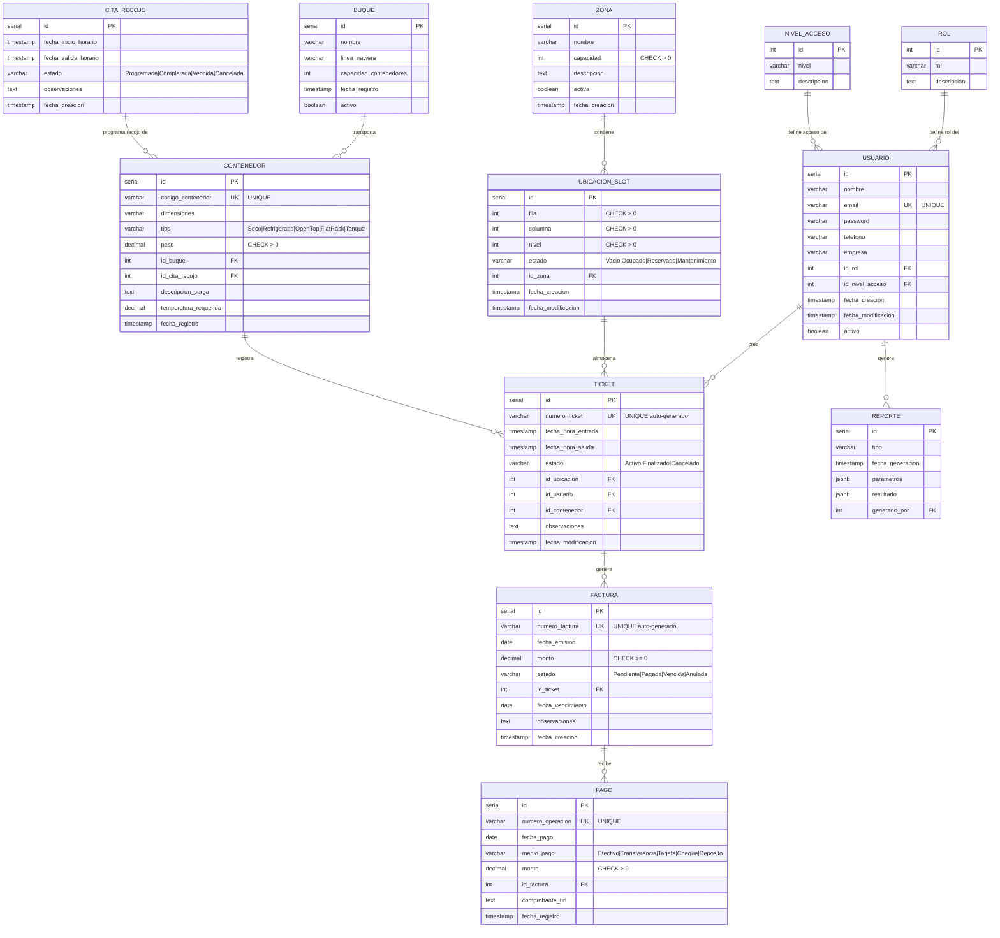
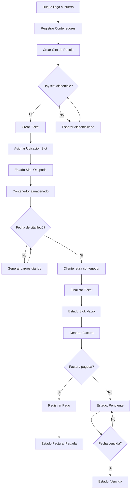

# 📊 Modelo de Datos - Sistema ENAPU

## Diagrama Entidad-Relación Completo

## Flujo de Operación Principal

## Descripción Detallada de Tablas

### 1️⃣ Tablas de Catálogo

#### ROL

- **Propósito**: Define los tres roles principales del sistema
- **Valores**:
  - (1) Administrador - Acceso total
  - (2) Operario - Operaciones del día a día
  - (3) Cliente - Solo consulta
- **Relaciones**: Se asigna a `Usuario`

#### NIVEL_ACCESO

- **Propósito**: Define el nivel de permisos
- **Valores**:
  - (1) Administración - Crear, Editar, Eliminar
  - (2) Operación - Crear, Editar
  - (3) Consulta - Solo lectura
- **Relaciones**: Se asigna a `Usuario`

---

### 2️⃣ Gestión de Usuarios

#### USUARIO

- **Propósito**: Almacena todos los usuarios del sistema (admins, operarios, clientes)
- **Campos claves**:
  - `email`: Único, se usa para login
  - `password`: Hash de contraseña (⚠️ usar bcrypt en producción)
  - `empresa`: Nombre de la empresa del cliente
  - `activo`: Para deshabilitar usuarios sin eliminarlos
- **Triggers**:
  - Actualiza `fecha_modificacion` automáticamente en cada UPDATE
- **Índices**: `email`, `id_rol`, `activo`
- **RLS**: Los usuarios solo ven su propia información, los admins ven todo

---

### 3️⃣ Gestión de Ubicación Física

#### ZONA

- **Propósito**: Representa las diferentes áreas del puerto
- **Tipos predefinidos**:
  - **Estandar Seco** (capacidad: 500) - Contenedores secos normales
  - **Especializada Reefer** (capacidad: 50) - Contenedores refrigerados con conexión eléctrica
  - **Inspeccion Vaciado** (capacidad: 10) - Área temporal para inspección/vaciado
- **Campos claves**:
  - `capacidad`: Máximo de slots que puede tener
  - `activa`: Permite deshabilitar zonas temporalmente

#### UBICACION_SLOT

- **Propósito**: Representa cada espacio individual donde se puede colocar un contenedor
- **Campos claves**:
  - `fila`, `columna`, `nivel`: Coordenadas 3D de la ubicación
  - `estado`: Estado actual del slot
    - `Vacio` - Disponible para uso
    - `Ocupado` - Tiene un contenedor
    - `Reservado` - Reservado para un contenedor específico
    - `Mantenimiento` - No disponible temporalmente
- **Constraint**: La combinación (fila, columna, nivel, zona) es única
- **Triggers**:
  - Se actualiza automáticamente cuando se crea/finaliza un Ticket
  - Actualiza `fecha_modificacion` en cada UPDATE
- **Índices**: `id_zona`, `estado`

---

### 4️⃣ Operaciones Marítimas

#### BUQUE

- **Propósito**: Registra los buques que llegan al puerto
- **Campos claves**:
  - `nombre`: Nombre del buque
  - `linea_naviera`: Compañía naviera
  - `capacidad_contenedores`: Capacidad teórica del buque
  - `activo`: Para marcar buques retirados
- **Relaciones**: Un buque puede transportar muchos contenedores

#### CITA_RECOJO

- **Propósito**: Programa cuándo un contenedor debe ser retirado
- **Campos claves**:
  - `fecha_inicio_horario`: Desde cuándo puede retirarse
  - `fecha_salida_horario`: Hasta cuándo debe retirarse
  - `estado`:
    - `Programada` - Cita futura
    - `Completada` - Contenedor ya retirado
    - `Vencida` - Pasó la fecha y no se retiró
    - `Cancelada` - Cita cancelada
- **Constraint**: `fecha_salida >= fecha_inicio`
- **Índices**: `estado`, `fecha_inicio_horario`

#### CONTENEDOR

- **Propósito**: Registra cada contenedor que ingresa al puerto
- **Campos claves**:
  - `codigo_contenedor`: Código único internacional del contenedor (ej: MSCU1234567)
  - `dimensiones`: Medidas en formato "largo x ancho x alto"
  - `tipo`: Tipo de contenedor
    - `Seco` - Contenedor estándar cerrado
    - `Refrigerado` - Requiere energía eléctrica
    - `Open Top` - Techo abierto
    - `Flat Rack` - Plataforma plana
    - `Tanque` - Para líquidos
  - `peso`: Peso en kilogramos
  - `descripcion_carga`: Qué contiene
  - `temperatura_requerida`: Solo para refrigerados
- **Relaciones**:
  - Pertenece a un `Buque`
  - Tiene una `Cita_recojo`
- **Índices**: `id_buque`, `tipo`, `id_cita_recojo`

---

### 5️⃣ Gestión Operativa

#### TICKET

- **Propósito**: Registra el almacenamiento de un contenedor (entrada/salida)
- **Campos claves**:
  - `numero_ticket`: Auto-generado con formato `TKT-YYYYMMDD-000001`
  - `fecha_hora_entrada`: Cuándo ingresó al puerto
  - `fecha_hora_salida`: Cuándo salió (NULL si está activo)
  - `estado`:
    - `Activo` - Contenedor aún en puerto
    - `Finalizado` - Contenedor ya retirado
    - `Cancelado` - Ticket cancelado
  - `id_ubicacion`: Dónde está almacenado
  - `id_usuario`: Quién procesó el ticket (operario)
  - `id_contenedor`: Qué contenedor es
- **Triggers**:
  - Auto-genera `numero_ticket` en INSERT
  - Actualiza estado de `Ubicacion_slot` automáticamente
  - Actualiza `fecha_modificacion` en UPDATE
- **Constraint**: `fecha_salida >= fecha_entrada`
- **Índices**: `estado`, `id_usuario`, `id_contenedor`, `fecha_hora_entrada`

#### FACTURA

- **Propósito**: Factura por el servicio de almacenamiento
- **Campos claves**:
  - `numero_factura`: Auto-generado con formato `FAC-YYYYMMDD-000001`
  - `fecha_emision`: Cuándo se generó
  - `monto`: Cantidad a pagar
  - `estado`:
    - `Pendiente` - Aún no pagada
    - `Pagada` - Ya pagada completa
    - `Vencida` - Pasó fecha de vencimiento
    - `Anulada` - Factura anulada
  - `fecha_vencimiento`: Fecha límite de pago
- **Triggers**: Auto-genera `numero_factura` en INSERT
- **Relaciones**: Se genera a partir de un `Ticket`
- **Índices**: `estado`, `id_ticket`, `fecha_emision`

#### PAGO

- **Propósito**: Registro de pagos recibidos
- **Campos claves**:
  - `numero_operacion`: Número de operación bancaria/referencia
  - `fecha_pago`: Cuándo se realizó el pago
  - `medio_pago`:
    - `Efectivo`
    - `Transferencia`
    - `Tarjeta`
    - `Cheque`
    - `Deposito`
  - `monto`: Cantidad pagada
  - `comprobante_url`: URL del comprobante digitalizado
- **Relaciones**: Se asocia a una `Factura`
- **Índices**: `id_factura`, `fecha_pago`

---

### 6️⃣ Reportería

#### REPORTE

- **Propósito**: Auditoría y registro de reportes generados
- **Campos claves**:
  - `tipo`: Tipo de reporte (ej: "Movimientos Diarios", "Ocupación de Zonas")
  - `parametros`: Parámetros usados (formato JSONB para flexibilidad)
  - `resultado`: Resultado del reporte (formato JSONB)
  - `generado_por`: Usuario que generó el reporte
- **Ventaja de JSONB**: Permite almacenar datos estructurados flexibles sin esquema rígido
- **Índices**: `tipo`, `fecha_generacion`

---

## Constraints y Validaciones

### Integridad Referencial

- ✅ Todas las FK tienen `ON DELETE RESTRICT` por defecto (evita borrados accidentales)
- ✅ Excepción: `Ubicacion_slot` tiene `ON DELETE CASCADE` desde `Zona` (si borras una zona, se borran sus slots)
- ✅ `Reporte.generado_por` tiene `ON DELETE SET NULL` (si borras el usuario, el reporte queda)

### Validaciones CHECK

- ✅ Capacidades > 0
- ✅ Coordenadas de slots > 0
- ✅ Pesos > 0
- ✅ Montos >= 0
- ✅ Fechas lógicas (salida >= entrada)
- ✅ Estados solo valores permitidos (usando CHECK con IN)

### Valores Únicos

- ✅ Email de usuario
- ✅ Código de contenedor
- ✅ Número de ticket
- ✅ Número de factura
- ✅ Número de operación de pago
- ✅ Combinación (fila, columna, nivel, zona) en slots

---

## Índices de Rendimiento

### Índices implementados (18 total):

**Usuario** (3):

- `idx_usuario_rol` en `id_rol`
- `idx_usuario_email` en `email`
- `idx_usuario_activo` en `activo`

**Ticket** (4):

- `idx_ticket_estado` en `estado`
- `idx_ticket_usuario` en `id_usuario`
- `idx_ticket_contenedor` en `id_contenedor`
- `idx_ticket_fecha_entrada` en `fecha_hora_entrada`

**Contenedor** (3):

- `idx_contenedor_buque` en `id_buque`
- `idx_contenedor_tipo` en `tipo`
- `idx_contenedor_cita` en `id_cita_recojo`

**Ubicacion_slot** (2):

- `idx_slot_zona` en `id_zona`
- `idx_slot_estado` en `estado`

**Factura** (3):

- `idx_factura_estado` en `estado`
- `idx_factura_ticket` en `id_ticket`
- `idx_factura_fecha` en `fecha_emision`

**Otros** (3):

- `idx_pago_factura` en `Pago.id_factura`
- `idx_pago_fecha` en `Pago.fecha_pago`
- `idx_cita_estado` en `Cita_recojo.estado`
- `idx_cita_fecha` en `Cita_recojo.fecha_inicio_horario`
- `idx_reporte_tipo` en `Reporte.tipo`
- `idx_reporte_fecha` en `Reporte.fecha_generacion`

---

## Funciones y Triggers

### Funciones Implementadas (6):

1. **`actualizar_fecha_modificacion()`**

   - Actualiza automáticamente el campo `fecha_modificacion` con la hora actual
   - Usado por: `Usuario`, `Ticket`, `Ubicacion_slot`

2. **`generar_numero_ticket()`**

   - Genera automáticamente el `numero_ticket` con formato `TKT-YYYYMMDD-XXXXXX`
   - Ejecuta en: INSERT a `Ticket`

3. **`generar_numero_factura()`**

   - Genera automáticamente el `numero_factura` con formato `FAC-YYYYMMDD-XXXXXX`
   - Ejecuta en: INSERT a `Factura`

4. **`actualizar_estado_ubicacion()`**

   - Actualiza el estado de `Ubicacion_slot` según el estado del `Ticket`
   - Lógica:
     - Ticket creado → Slot a 'Ocupado'
     - Ticket finalizado/cancelado → Slot a 'Vacio'
   - Ejecuta en: INSERT, UPDATE, DELETE en `Ticket`

5. **`calcular_costo_almacenaje(ticket_id)`**

   - Calcula el costo de almacenaje basado en:
     - Días almacenado
     - Tipo de contenedor (diferentes tarifas)
   - Retorna: Monto decimal

6. **`obtener_slots_disponibles(tipo_contenedor)`**
   - Retorna slots vacíos apropiados para el tipo de contenedor
   - Lógica:
     - Refrigerados → Solo zona "Especializada Reefer"
     - Otros → Zonas que no sean Reefer
   - Retorna: Tabla con slots disponibles

---

## Consideraciones de Seguridad (RLS)

### Row Level Security (RLS)

**Estado actual**: RLS está **comentado** en el script porque requiere Supabase Auth.

**Cuando activar RLS**:

1. Configura Supabase Authentication
2. Descomenta la sección "PASO 11" del script
3. Ejecuta las políticas RLS
4. Ajusta según tus reglas de negocio

**Políticas incluidas**:

#### Usuario:

- **`admin_all_usuarios`**: Administradores ven todos los usuarios
- **`usuario_ver_propio`**: Usuarios ven solo su información

#### Ticket:

- **`admin_operario_ver_tickets`**: Admins y Operarios ven todos los tickets
- **`cliente_ver_propios_tickets`**: Clientes solo ven sus tickets

---

## Datos Iniciales (Seed Data)

El script incluye datos de ejemplo:

- ✅ 3 Roles
- ✅ 3 Niveles de acceso
- ✅ 10 Usuarios (2 admins, 8 operarios, 20 clientes)
- ✅ 3 Zonas
- ✅ 25 Ubicaciones (slots)
- ✅ 10 Buques
- ✅ 13 Citas (5 completadas, 3 vencidas, 5 programadas)
- ✅ 13 Contenedores
- ✅ 8 Tickets (5 finalizados, 3 activos)
- ✅ 7 Facturas
- ✅ 4 Pagos
- ✅ 4 Reportes

---

## Próximos Pasos

1. **Ejecutar el script** `supabase_migration_complete.sql` en Supabase
2. **Verificar** que todas las tablas, funciones y datos se crearon correctamente
3. **Configurar** Supabase Auth (opcional pero recomendado)
4. **Habilitar RLS** cuando tengas Auth configurado
5. **Conectar** tu frontend usando el cliente de Supabase
6. **Implementar** hash de contraseñas (bcrypt o Supabase Auth)
7. **Probar** todas las operaciones CRUD

---

## Referencias

- [Script de Migración Completo](./supabase_migration_complete.sql)
- [Guía de Migración](./GUIA_MIGRACION_SUPABASE.md)
- [Consultas Útiles](./consultas_utiles_supabase.sql)
- [Documentación Supabase](https://supabase.com/docs)
